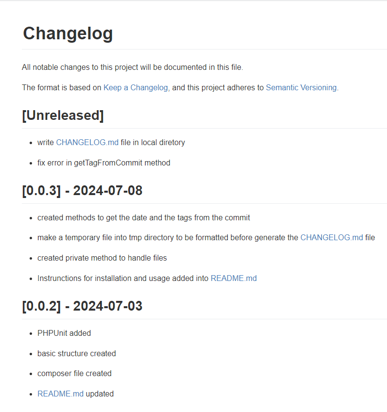
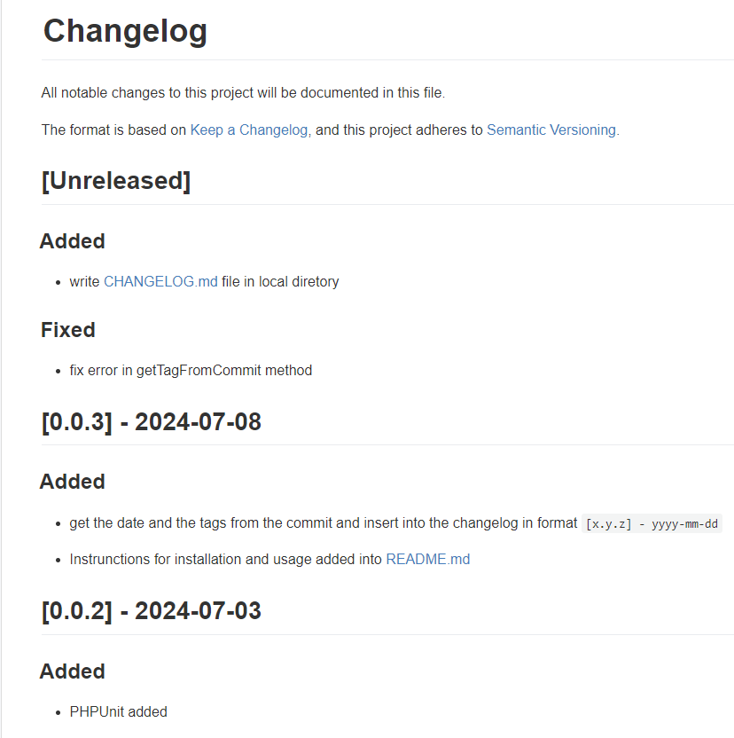

# Auto Changelog for PHP Projects

Creates a changelog file automatically from git logs

## Requirements

- Git
- PHP
- Composer

## Installation

    composer require --dev joshuawebdev/auto-changelog

## Usage

    php vendor/joshuawebdev/auto-changelog/generate.php

After run the command above you get a CHANGELOG.md file like this:

</img>

You can then change the CHANGELOG.md file to add more information, remove unnecessary information or change the commit messages, as shown in the image below.

</img>

To learn more about the syntax of a changelog, visit [Keep a Changelog](https://keepachangelog.com/en/1.1.0/).
